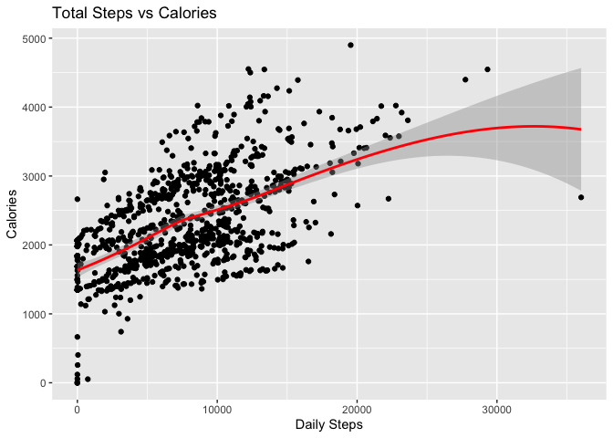
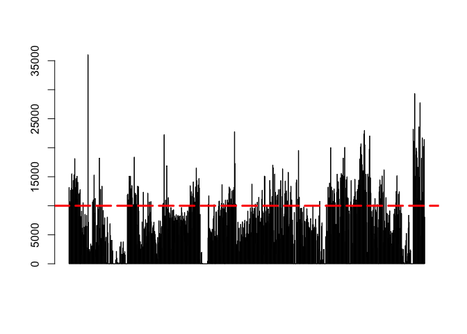
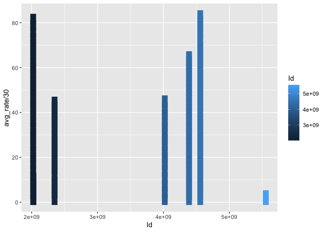
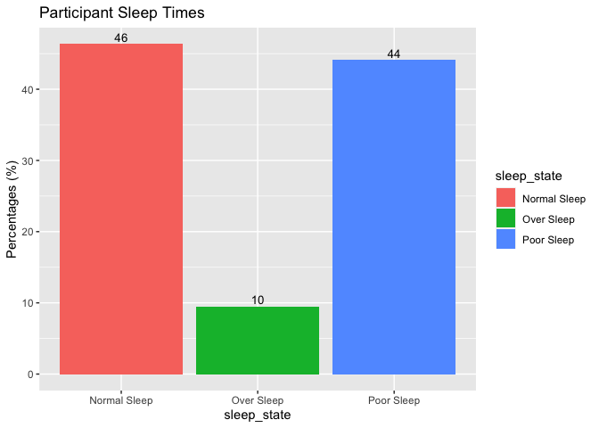
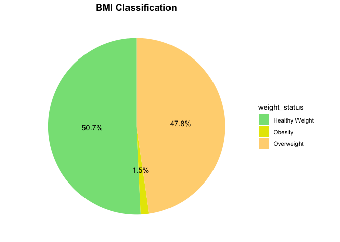

Capstone_Bellabeat
================
Scott Pullen
2022-08-14

**Bellabeat Case Study**


***ASK***

**Bellabeat History**: Urška Sršen and Sando Mur founded Bellabeat, a
high-tech company that manufactures health-focused smart products. Sršen
used her background as an artist to develop beautifully designed
technology that informs and inspires women around the world. Collecting
data on activity, sleep, stress, and reproductive health has allowed
Bellabeat to empower women with knowledge about their own health and
habits. Since it was founded in 2013, Bellabeat has grown rapidly and
quickly positioned itself as a tech-driven wellness company for women.

Bellabeat main product lineup includes the following:

-   *Bellabeat app: provides users with health data related to their
    activity, sleep, stress,menstrual cycle, and mindfulness habits.*

-   Leaf: classic wellness tracker can be worn as a bracelet, necklace,
    or clip.

-   *Time: wellness watch combines the timeless look of a classic
    timepiece with smart technology to track user activity, sleep, and
    stress.*

-   Spring: a water bottle that tracks daily water intake using smart
    technology to ensure that you are appropriately hydrated throughout
    the day.

**Stakeholder Ask**: Analyze smart device usage data in order to gain
insight into how consumers use non-Bellabeat smart devices, then select
one Bellabeat product to apply these insights to.

**Questions for the analysis**:

-   What are some trends in smart device usage?

-   How could these trends apply to Bellabeat customers?

-   How could these trends help influence Bellabeat marketing strategy?

***PREPARE***


**Dataset Used**: The data source used for our case study is FitBit
Fitness Tracker Data. This dataset is stored in Kaggle and was made
available through Mobius. This dataset was generated by respondents to a
distributed survey via Amazon Mechanical Turk between
03.12.2016-05.12.2016. Thirty eligible Fitbit users consented to the
submission of personal tracker data, including minute-level output for
physical activity, heart rate, and sleep monitoring. Limitations exist
within the data due to a lack of sample size in some files as well as
demographics of the participants.

**Installing & Loading of packages:**

``` r
library(tidyverse)
```

    ## ── Attaching packages ─────────────────────────────────────── tidyverse 1.3.2 ──
    ## ✔ ggplot2 3.3.6     ✔ purrr   0.3.4
    ## ✔ tibble  3.1.8     ✔ dplyr   1.0.9
    ## ✔ tidyr   1.2.0     ✔ stringr 1.4.0
    ## ✔ readr   2.1.2     ✔ forcats 0.5.1
    ## ── Conflicts ────────────────────────────────────────── tidyverse_conflicts() ──
    ## ✖ dplyr::filter() masks stats::filter()
    ## ✖ dplyr::lag()    masks stats::lag()

``` r
library(here)
```

    ## here() starts at /Users/sapsair/Capstone_Bellabeat

``` r
library(skimr)
library(janitor)
```

    ## 
    ## Attaching package: 'janitor'
    ## 
    ## The following objects are masked from 'package:stats':
    ## 
    ##     chisq.test, fisher.test

``` r
library(dplyr)
```

**Importing Datasets**

After inspecting all 18 of the datasets we will choose the ones to help
us with our ask:

``` r
setwd("/Users/sapsair/Downloads/Fitabase Data 4.12.16-5.12.16")
daily_activity <- read.csv("dailyActivity_merged.csv")
daily_calories <- read.csv("dailyCalories_merged.csv")
daily_intensities <- read.csv("dailyIntensities_merged.csv")
daily_steps <- read.csv("dailySteps_merged.csv")
heartrate_sec <- read.csv("heartrate_seconds_merged.csv")
sleep_day <- read.csv("sleepDay_merged.csv")
weight_log <- read.csv("weightLogInfo_merged.csv")
```

Let’s take a look at the data:

``` r
##daily_activity

head(daily_activity)
```

    ##           Id ActivityDate TotalSteps TotalDistance TrackerDistance
    ## 1 1503960366    4/12/2016      13162          8.50            8.50
    ## 2 1503960366    4/13/2016      10735          6.97            6.97
    ## 3 1503960366    4/14/2016      10460          6.74            6.74
    ## 4 1503960366    4/15/2016       9762          6.28            6.28
    ## 5 1503960366    4/16/2016      12669          8.16            8.16
    ## 6 1503960366    4/17/2016       9705          6.48            6.48
    ##   LoggedActivitiesDistance VeryActiveDistance ModeratelyActiveDistance
    ## 1                        0               1.88                     0.55
    ## 2                        0               1.57                     0.69
    ## 3                        0               2.44                     0.40
    ## 4                        0               2.14                     1.26
    ## 5                        0               2.71                     0.41
    ## 6                        0               3.19                     0.78
    ##   LightActiveDistance SedentaryActiveDistance VeryActiveMinutes
    ## 1                6.06                       0                25
    ## 2                4.71                       0                21
    ## 3                3.91                       0                30
    ## 4                2.83                       0                29
    ## 5                5.04                       0                36
    ## 6                2.51                       0                38
    ##   FairlyActiveMinutes LightlyActiveMinutes SedentaryMinutes Calories
    ## 1                  13                  328              728     1985
    ## 2                  19                  217              776     1797
    ## 3                  11                  181             1218     1776
    ## 4                  34                  209              726     1745
    ## 5                  10                  221              773     1863
    ## 6                  20                  164              539     1728

``` r
colnames(daily_activity)
```

    ##  [1] "Id"                       "ActivityDate"            
    ##  [3] "TotalSteps"               "TotalDistance"           
    ##  [5] "TrackerDistance"          "LoggedActivitiesDistance"
    ##  [7] "VeryActiveDistance"       "ModeratelyActiveDistance"
    ##  [9] "LightActiveDistance"      "SedentaryActiveDistance" 
    ## [11] "VeryActiveMinutes"        "FairlyActiveMinutes"     
    ## [13] "LightlyActiveMinutes"     "SedentaryMinutes"        
    ## [15] "Calories"

``` r
##daily_calories

head(daily_calories)
```

    ##           Id ActivityDay Calories
    ## 1 1503960366   4/12/2016     1985
    ## 2 1503960366   4/13/2016     1797
    ## 3 1503960366   4/14/2016     1776
    ## 4 1503960366   4/15/2016     1745
    ## 5 1503960366   4/16/2016     1863
    ## 6 1503960366   4/17/2016     1728

``` r
colnames(daily_calories)
```

    ## [1] "Id"          "ActivityDay" "Calories"

``` r
##daily_intensities

head(daily_intensities)
```

    ##           Id ActivityDay SedentaryMinutes LightlyActiveMinutes
    ## 1 1503960366   4/12/2016              728                  328
    ## 2 1503960366   4/13/2016              776                  217
    ## 3 1503960366   4/14/2016             1218                  181
    ## 4 1503960366   4/15/2016              726                  209
    ## 5 1503960366   4/16/2016              773                  221
    ## 6 1503960366   4/17/2016              539                  164
    ##   FairlyActiveMinutes VeryActiveMinutes SedentaryActiveDistance
    ## 1                  13                25                       0
    ## 2                  19                21                       0
    ## 3                  11                30                       0
    ## 4                  34                29                       0
    ## 5                  10                36                       0
    ## 6                  20                38                       0
    ##   LightActiveDistance ModeratelyActiveDistance VeryActiveDistance
    ## 1                6.06                     0.55               1.88
    ## 2                4.71                     0.69               1.57
    ## 3                3.91                     0.40               2.44
    ## 4                2.83                     1.26               2.14
    ## 5                5.04                     0.41               2.71
    ## 6                2.51                     0.78               3.19

``` r
colnames(daily_intensities)
```

    ##  [1] "Id"                       "ActivityDay"             
    ##  [3] "SedentaryMinutes"         "LightlyActiveMinutes"    
    ##  [5] "FairlyActiveMinutes"      "VeryActiveMinutes"       
    ##  [7] "SedentaryActiveDistance"  "LightActiveDistance"     
    ##  [9] "ModeratelyActiveDistance" "VeryActiveDistance"

``` r
##daily_steps

head(daily_steps)
```

    ##           Id ActivityDay StepTotal
    ## 1 1503960366   4/12/2016     13162
    ## 2 1503960366   4/13/2016     10735
    ## 3 1503960366   4/14/2016     10460
    ## 4 1503960366   4/15/2016      9762
    ## 5 1503960366   4/16/2016     12669
    ## 6 1503960366   4/17/2016      9705

``` r
colnames(daily_steps)
```

    ## [1] "Id"          "ActivityDay" "StepTotal"

``` r
##heartrate_sec

head(heartrate_sec)
```

    ##           Id                 Time Value
    ## 1 2022484408 4/12/2016 7:21:00 AM    97
    ## 2 2022484408 4/12/2016 7:21:05 AM   102
    ## 3 2022484408 4/12/2016 7:21:10 AM   105
    ## 4 2022484408 4/12/2016 7:21:20 AM   103
    ## 5 2022484408 4/12/2016 7:21:25 AM   101
    ## 6 2022484408 4/12/2016 7:22:05 AM    95

``` r
colnames(heartrate_sec)
```

    ## [1] "Id"    "Time"  "Value"

``` r
##sleep_day

head(sleep_day)
```

    ##           Id              SleepDay TotalSleepRecords TotalMinutesAsleep
    ## 1 1503960366 4/12/2016 12:00:00 AM                 1                327
    ## 2 1503960366 4/13/2016 12:00:00 AM                 2                384
    ## 3 1503960366 4/15/2016 12:00:00 AM                 1                412
    ## 4 1503960366 4/16/2016 12:00:00 AM                 2                340
    ## 5 1503960366 4/17/2016 12:00:00 AM                 1                700
    ## 6 1503960366 4/19/2016 12:00:00 AM                 1                304
    ##   TotalTimeInBed
    ## 1            346
    ## 2            407
    ## 3            442
    ## 4            367
    ## 5            712
    ## 6            320

``` r
colnames(sleep_day)
```

    ## [1] "Id"                 "SleepDay"           "TotalSleepRecords" 
    ## [4] "TotalMinutesAsleep" "TotalTimeInBed"

``` r
##weight_log

head(weight_log)
```

    ##           Id                  Date WeightKg WeightPounds Fat   BMI
    ## 1 1503960366  5/2/2016 11:59:59 PM     52.6     115.9631  22 22.65
    ## 2 1503960366  5/3/2016 11:59:59 PM     52.6     115.9631  NA 22.65
    ## 3 1927972279  4/13/2016 1:08:52 AM    133.5     294.3171  NA 47.54
    ## 4 2873212765 4/21/2016 11:59:59 PM     56.7     125.0021  NA 21.45
    ## 5 2873212765 5/12/2016 11:59:59 PM     57.3     126.3249  NA 21.69
    ## 6 4319703577 4/17/2016 11:59:59 PM     72.4     159.6147  25 27.45
    ##   IsManualReport        LogId
    ## 1           True 1.462234e+12
    ## 2           True 1.462320e+12
    ## 3          False 1.460510e+12
    ## 4           True 1.461283e+12
    ## 5           True 1.463098e+12
    ## 6           True 1.460938e+12

``` r
colnames(weight_log)
```

    ## [1] "Id"             "Date"           "WeightKg"       "WeightPounds"  
    ## [5] "Fat"            "BMI"            "IsManualReport" "LogId"

After inspection we see that the data contained in 3 of the data frames
is also contained in daily_activity, lets remove the 3 to keep our
Environment less cluttered:

``` r
rm(daily_calories)
rm(daily_intensities)
rm(daily_steps)
```

Let’s take a look at how many individual participants were tracked in
each:

``` r
n_distinct(daily_activity$Id)
```

    ## [1] 33

``` r
n_distinct(heartrate_sec$Id)
```

    ## [1] 14

``` r
n_distinct(sleep_day$Id)
```

    ## [1] 24

``` r
n_distinct(weight_log$Id)
```

    ## [1] 8

We find that 1 table show 33 unique Id’s while the sleepDay is 24,
heartrate_sec is 14 and weight_log table shows only 8 Id’s. *Need to
work back with marketing on strategy to collect more heartrate and
weight log information from our devices to get a better idea on how we
can tie this data into future analysis.*

Continue to clean looking for duplicates:

``` r
sum(duplicated(daily_activity))
```

    ## [1] 0

``` r
sum(duplicated(heartrate_sec))
```

    ## [1] 0

``` r
sum(duplicated(sleep_day))
```

    ## [1] 3

``` r
sum(duplicated(weight_log))
```

    ## [1] 0

Sleep_day is showing 3 duplicates, let’s remove:

``` r
sleep_day <- sleep_day %>% 
  distinct() %>% 
  drop_na()
```

Verying the duplicates were removed:

``` r
sum(duplicated(sleep_day))
```

    ## [1] 0

Success!

***ANALYZE***


We will now breakdown and look at summaries for our remaining data:

**Summary of daily_activity**

``` r
summary(daily_activity)
```

    ##        Id            ActivityDate         TotalSteps    TotalDistance   
    ##  Min.   :1.504e+09   Length:940         Min.   :    0   Min.   : 0.000  
    ##  1st Qu.:2.320e+09   Class :character   1st Qu.: 3790   1st Qu.: 2.620  
    ##  Median :4.445e+09   Mode  :character   Median : 7406   Median : 5.245  
    ##  Mean   :4.855e+09                      Mean   : 7638   Mean   : 5.490  
    ##  3rd Qu.:6.962e+09                      3rd Qu.:10727   3rd Qu.: 7.713  
    ##  Max.   :8.878e+09                      Max.   :36019   Max.   :28.030  
    ##  TrackerDistance  LoggedActivitiesDistance VeryActiveDistance
    ##  Min.   : 0.000   Min.   :0.0000           Min.   : 0.000    
    ##  1st Qu.: 2.620   1st Qu.:0.0000           1st Qu.: 0.000    
    ##  Median : 5.245   Median :0.0000           Median : 0.210    
    ##  Mean   : 5.475   Mean   :0.1082           Mean   : 1.503    
    ##  3rd Qu.: 7.710   3rd Qu.:0.0000           3rd Qu.: 2.053    
    ##  Max.   :28.030   Max.   :4.9421           Max.   :21.920    
    ##  ModeratelyActiveDistance LightActiveDistance SedentaryActiveDistance
    ##  Min.   :0.0000           Min.   : 0.000      Min.   :0.000000       
    ##  1st Qu.:0.0000           1st Qu.: 1.945      1st Qu.:0.000000       
    ##  Median :0.2400           Median : 3.365      Median :0.000000       
    ##  Mean   :0.5675           Mean   : 3.341      Mean   :0.001606       
    ##  3rd Qu.:0.8000           3rd Qu.: 4.782      3rd Qu.:0.000000       
    ##  Max.   :6.4800           Max.   :10.710      Max.   :0.110000       
    ##  VeryActiveMinutes FairlyActiveMinutes LightlyActiveMinutes SedentaryMinutes
    ##  Min.   :  0.00    Min.   :  0.00      Min.   :  0.0        Min.   :   0.0  
    ##  1st Qu.:  0.00    1st Qu.:  0.00      1st Qu.:127.0        1st Qu.: 729.8  
    ##  Median :  4.00    Median :  6.00      Median :199.0        Median :1057.5  
    ##  Mean   : 21.16    Mean   : 13.56      Mean   :192.8        Mean   : 991.2  
    ##  3rd Qu.: 32.00    3rd Qu.: 19.00      3rd Qu.:264.0        3rd Qu.:1229.5  
    ##  Max.   :210.00    Max.   :143.00      Max.   :518.0        Max.   :1440.0  
    ##     Calories   
    ##  Min.   :   0  
    ##  1st Qu.:1828  
    ##  Median :2134  
    ##  Mean   :2304  
    ##  3rd Qu.:2793  
    ##  Max.   :4900

*Analysis:*

From a high level overview of active minutes, our subjects average 192
minutes which ranks them as above average compared to the CDC guidance
of at least 150 minutes of “moderate” activity like brisk walking. When
looking at average steps of our surveyed users we find the mean (7,638
steps) falls well below CDC guidance of 10,000 steps. We are not getting
an account for muscle-strengthening activities which CDC guides as at
least 2 or more days a week. Something our marketing team should look
into as we move to help our users get into their best health.
Notifications should be implemented for Total Steps in order to help
users understand a baseline for calories burned per day. *calories
burned per minute= 0.0175 x MET x weight in kilograms*

``` r
ggplot(daily_activity, aes(x=TotalSteps, y=Calories)) + geom_jitter() + geom_smooth(color = "red") + labs(title = "Total Steps vs Calories", x="Daily Steps", y= "Calories")
```

    ## `geom_smooth()` using method = 'loess' and formula 'y ~ x'

<!-- -->

``` r
barplot(daily_activity$TotalSteps)
abline(h=10000, col = "Red", lty = 5, lwd = 3)
```

<!-- -->

**Summary of heartrate_sec**

``` r
summary(heartrate_sec)
```

    ##        Id                Time               Value       
    ##  Min.   :2.022e+09   Length:2483658     Min.   : 36.00  
    ##  1st Qu.:4.388e+09   Class :character   1st Qu.: 63.00  
    ##  Median :5.554e+09   Mode  :character   Median : 73.00  
    ##  Mean   :5.514e+09                      Mean   : 77.33  
    ##  3rd Qu.:6.962e+09                      3rd Qu.: 88.00  
    ##  Max.   :8.878e+09                      Max.   :203.00

Manipulated the original file in excel with a pivot table to get the
average heart rate per day for better visualization. *Upload to
Environment*

``` r
setwd("/Users/sapsair/Downloads/Fitabase Data 4.12.16-5.12.16")
heartrate_day <- read.csv("heartrate_dayavg.csv")
```

*Analysis*

With a limited group of unique Id’s who submitted heart rate data we
wont dive in deep but wanted to display an average by day across users.
We dont have demographic info such as age so it will be difficult to
make conclusions as the CDC guidance is a resting heart rate between
60-100 beats/min.

``` r
ggplot(heartrate_day, aes(x=Id, y=avg_rate/30, color=Id)) +
    geom_col(size=4)
```

<!-- -->

**Summary of sleep_day**

``` r
summary(sleep_day)
```

    ##        Id              SleepDay         TotalSleepRecords TotalMinutesAsleep
    ##  Min.   :1.504e+09   Length:410         Min.   :1.00      Min.   : 58.0     
    ##  1st Qu.:3.977e+09   Class :character   1st Qu.:1.00      1st Qu.:361.0     
    ##  Median :4.703e+09   Mode  :character   Median :1.00      Median :432.5     
    ##  Mean   :4.995e+09                      Mean   :1.12      Mean   :419.2     
    ##  3rd Qu.:6.962e+09                      3rd Qu.:1.00      3rd Qu.:490.0     
    ##  Max.   :8.792e+09                      Max.   :3.00      Max.   :796.0     
    ##  TotalTimeInBed 
    ##  Min.   : 61.0  
    ##  1st Qu.:403.8  
    ##  Median :463.0  
    ##  Mean   :458.5  
    ##  3rd Qu.:526.0  
    ##  Max.   :961.0

Create a column for classification of sleep state:

``` r
sleep_day_clas<- sleep_day %>% 
    mutate(sleep_state = case_when(TotalMinutesAsleep < 420 ~ "Poor Sleep", TotalMinutesAsleep >=420 & TotalMinutesAsleep < 540 ~ "Normal Sleep", TotalMinutesAsleep >540 ~ "Over Sleep"))

sleep_chart<- sleep_day_clas %>% 
  group_by(sleep_state) %>% 
  summarise(total = n()) %>% 
  mutate(totals = sum(total)) %>% 
  group_by(sleep_state) %>% 
  summarise(total_percent = total/totals * 100)
```

*Analysis*

Bellabeat marketing should take a more focused approach on pushing the
benefits of sleep. According to the Sleep Foundation:

-   almost half of Americans say they feel sleepy during the day between
    3-7 days/week

-   35.2% of all adults in the U.S. report sleeping for an average of
    less than 7 hours/night

-   42.6% of single parents sleep less than 7 hours/night

Our data showcases 44% of Id’s surveyed reported Poor Sleep, and 10%
reported Over Sleep. The impact of Over Sleeping can be just as negative
as having too little sleep. Impacts of Over Sleeping can be as follows:

-   Decreased immune function

-   Can lead to chronic disease

-   Obesity/Coranary heart disease

``` r
ggplot(sleep_chart, aes(x=sleep_state,y=total_percent,fill=sleep_state ))+
  geom_bar(stat = "identity") +
  geom_text(aes(label=round(total_percent,digits = 0)),vjust= -0.3,size=3.5)+
  labs(title = "Participant Sleep Times",y="Percentages (%)")
```

<!-- -->

**Sumamry for weight_log**

``` r
summary(weight_log)
```

    ##        Id                Date              WeightKg       WeightPounds  
    ##  Min.   :1.504e+09   Length:67          Min.   : 52.60   Min.   :116.0  
    ##  1st Qu.:6.962e+09   Class :character   1st Qu.: 61.40   1st Qu.:135.4  
    ##  Median :6.962e+09   Mode  :character   Median : 62.50   Median :137.8  
    ##  Mean   :7.009e+09                      Mean   : 72.04   Mean   :158.8  
    ##  3rd Qu.:8.878e+09                      3rd Qu.: 85.05   3rd Qu.:187.5  
    ##  Max.   :8.878e+09                      Max.   :133.50   Max.   :294.3  
    ##                                                                         
    ##       Fat             BMI        IsManualReport         LogId          
    ##  Min.   :22.00   Min.   :21.45   Length:67          Min.   :1.460e+12  
    ##  1st Qu.:22.75   1st Qu.:23.96   Class :character   1st Qu.:1.461e+12  
    ##  Median :23.50   Median :24.39   Mode  :character   Median :1.462e+12  
    ##  Mean   :23.50   Mean   :25.19                      Mean   :1.462e+12  
    ##  3rd Qu.:24.25   3rd Qu.:25.56                      3rd Qu.:1.462e+12  
    ##  Max.   :25.00   Max.   :47.54                      Max.   :1.463e+12  
    ##  NA's   :65

Adding a column for classification of BMI according to CDC:

``` r
bmi_clas <- weight_log %>% 
  mutate(weight_status = case_when(weight_log$BMI < 18.5 ~ "Underweight", weight_log$BMI >= 18.6 & weight_log$BMI < 24.9 ~ "Healthy Weight", weight_log$BMI > 25 & weight_log$BMI< 29.9 ~ "Overweight", weight_log$BMI > 30 ~ "Obesity"))
```

Creating a data frame with percentage of each weight status:

``` r
weight_status_percent <- bmi_clas %>% 
  group_by(weight_status) %>% 
  summarise(total = n()) %>% 
  mutate(totals = sum(total)) %>% 
  group_by(weight_status) %>% 
  summarise(total_percent = total / totals) %>% 
  mutate(labels = scales::percent(total_percent))
```

*Analysis*

Although the sample size for our weight log data was small we will still
analyze the data given as Bellabeat being a health and wellness company
should provide all data our customers need to better their lives.

Our data shows that only half 50.7% of the users are classified as
having healthy weight vs 47.8% overwieght, and 1.5% obese. Health
consequences of obesity include some of the following:

-   High Blood Pressure

-   Type 2 Diabetes

-   Stroke

-   Body pain and difficulty with physical functioning

``` r
weight_status_percent %>%
  ggplot(aes(x="",y=total_percent, fill=weight_status)) +
  geom_bar(stat = "identity", width = 1)+
  coord_polar("y", start=0)+
  theme_minimal()+
  theme(axis.title.x= element_blank(),
        axis.title.y = element_blank(),
        panel.border = element_blank(), 
        panel.grid = element_blank(), 
        axis.ticks = element_blank(),
        axis.text.x = element_blank(),
        plot.title = element_text(hjust = 0.5, size=14, face = "bold")) +
   scale_fill_manual(values = c("#85e085","#e6e600", "#ffd480")) +
   geom_text(aes(label = labels),
             position = position_stack(vjust = 0.5))+
   labs(title="BMI Classification")
```

<!-- -->

***SHARE***

Conclusions:

*Daily Activity*

-   Surveyed users show an average 192 mins of activity which puts them
    above average compared to the CDC guidance of 150 mins

-   Daily steps averaged 7638 in our data falling below CDC guidance of
    10,000 steps

-   We are not getting an account for muscle-strengthening activities,
    this could be a corner of the market that Bellabeat should also
    focus on as the benefits of muscle strengthening activities is a
    crucial benefit for females to maintain bone density and physicality
    into the later stages of life

-   Notifications should be implemented for Total Steps in order to help
    users understand a baseline for calories burned per day. *calories
    burned per minute= 0.0175 x MET x weight in kilograms*

*Sleep*

-   Another area of the fitness/wearable category Bellabeat should focus
    on is the benefits of sleep. While the data was missing alot of
    records from the surveyed users, correlations can be drawn between
    overall health & wellness and sleep

-   44% of surveyed reported “Poor Sleep” and another 10% “Over Sleep”.
    Two recommendations on this front. 1. Better notification
    integration for a wind down time, limiting blue light interactions
    and other stimuli. 2. Marketing should focus on wearability while
    sleeping and sleep tracking capabilities. Our devices need to have
    the battery life to deal with this so Product Development should be
    looped in to the discussion

*Weight*

-   While the users who reported weight was very small in comparison to
    our other surveys, we should assume most owners of fitness wearables
    are doing so in order to monitor their weight (loss, maintenance,
    etc).

-   47.8% of those surveyed registered as having BMI’s in the Overweight
    category. This has both serious consequences to one’s personal
    health as well as an effect on the country they reside via medical
    costs, mortality rates and more.

-   Bellabeat app should work to integrate existing app partnerships
    such as MyFitnessPal and others. We dont need to spend resources on
    the creation but team up with the best who have already made a great
    product.

*Additional Recommendations*

Marketing should work to implement a more social media focused drive to
highlight the benefits of our female empowerment products. What
influencers on Instagram/Youtube do we have and what is it we are
looking for them to focus on. Pushing the latest product IVY should be a
focus.

Existing app compatibility with MyFitnessPal, RunKeeper, etc should be
developed and implemented. Expand the abilities of our hardware with
partnerships.


